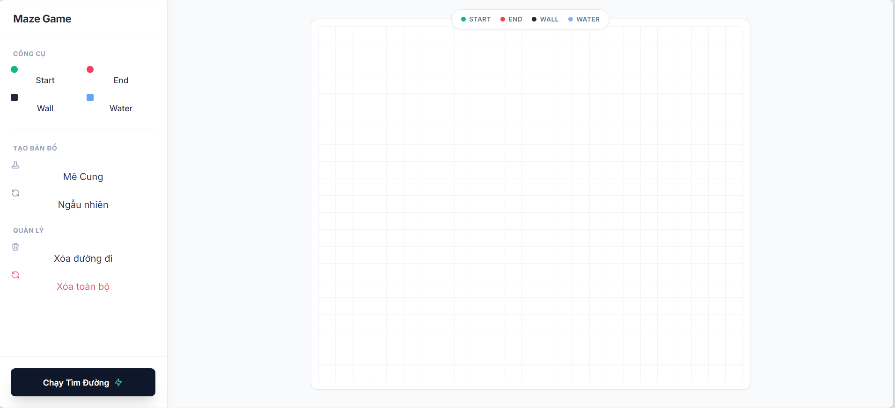
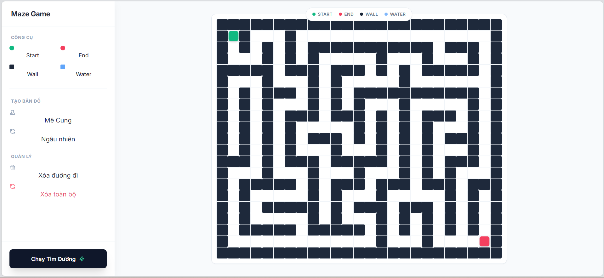
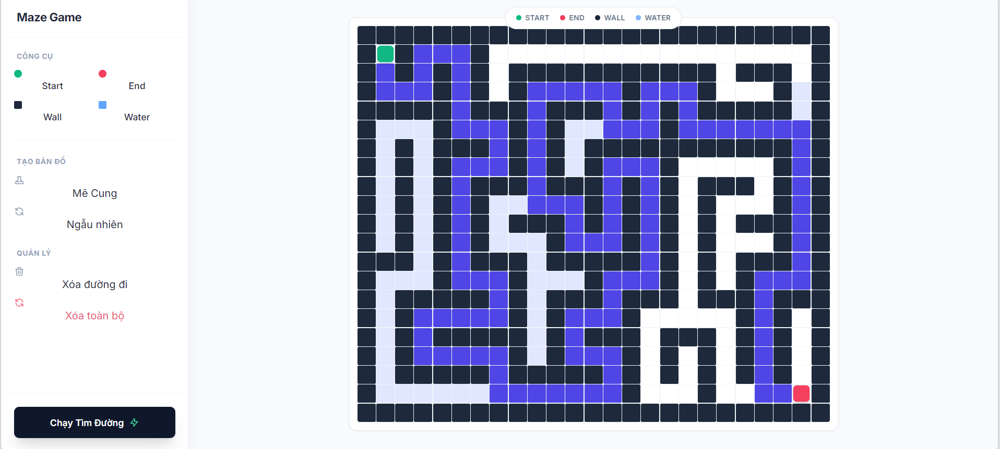

# Maze Game

Đây là một dự án nhỏ minh họa thuật toán tìm đường A\* kết hợp với bộ tạo mê cung (DFS backtracking). Ứng dụng là một Flask web app cho phép sinh mê cung, sau đó giải đường từ `start` đến `end` và trả về đường đi cùng thứ tự các ô đã thăm.

**Tệp chính:**

- `app.py`: Flask app, cung cấp giao diện HTML và hai API: `/generate_maze` và `/solve`.
- `solve.py`: Chứa `GridMap`, `AStarSolver`, `MazeArchitect` và các hằng số `TerrainType`/`MovementCost`.
- `templates/index.html`: Giao diện web (client).
- `static/script.js`: Script client để gọi API.

Yêu cầu cài đặt

- Python 3.8+ (Windows)
- Cài Flask:

```bash
python -m venv venv
venv\Scripts\activate
pip install Flask
```

Chạy ứng dụng

```bash
# trong thư mục dự án
python app.py
```

Mở trình duyệt tới http://127.0.0.1:5000/ để dùng giao diện.

API

- `POST /generate_maze` — body JSON: `{"rows": <số>, "cols": <số>}`
  - Trả về: `{"grid": [[...]], "start": [r,c], "end": [r,c]}`
- `POST /solve` — body JSON: `{"grid": [[...]], "start": [r,c], "end": [r,c]}`
  - Trả về: `{"path": [[r,c], ...], "visited": [[r,c], ...]}`

Ví dụ nhanh (curl)

```bash
# tạo mê cung 21x21
curl -X POST -H "Content-Type: application/json" -d "{\"rows\":21,\"cols\":21}" http://127.0.0.1:5000/generate_maze

# giải mê cung (sau khi có grid từ /generate_maze)
curl -X POST -H "Content-Type: application/json" -d "{\"grid\": ..., \"start\": [1,1], \"end\": [19,19]}" http://127.0.0.1:5000/solve
```

Kết quả console khi chạy thành công

```
 * Serving Flask app 'app'
 * Debug mode: on
 * Running on http://127.0.0.1:5000/ (Press CTRL+C to quit)
```

##Demo

<h3>Giao diện trang đầu</h3>


<h3>Sinh mê cung ngẫu nhiên</h3>


<h3>Giải mê cung bằng A*</h3>

